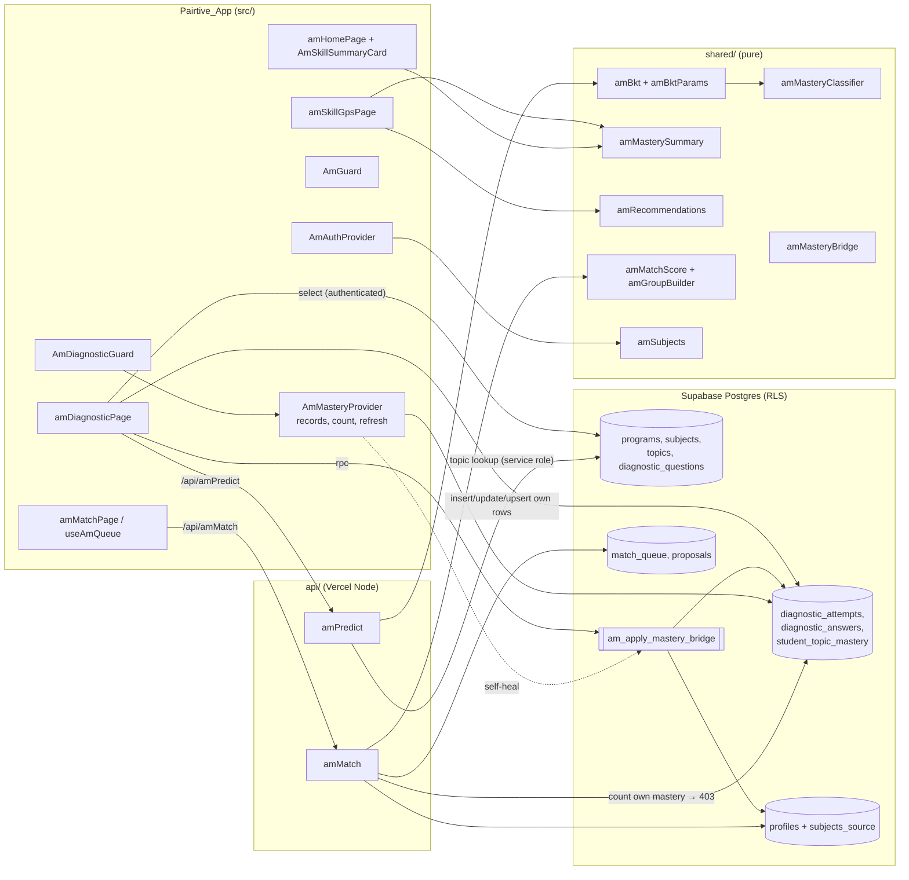
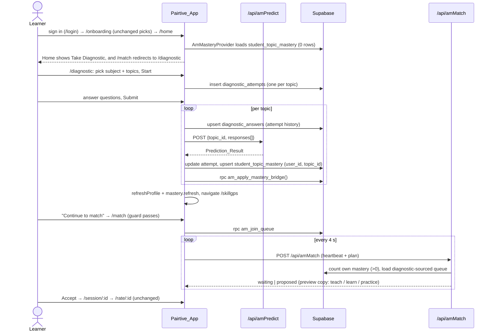

# Design Document: SkillGPS Matching Integration

## Overview

This design merges the Diagnostic/SkillGPS module from `origin/diagnostic-skillgps-module` (`modules/diagnostic-skillgps/`) into the Pairtive main app and makes the diagnostic the source of each learner's `strong_subjects` / `weak_subjects`. It is grounded in the current main-branch code (`shared/amMatchScore.js`, `shared/amGroupBuilder.js`, `shared/amSubjects.js`, `api/amMatch.js`, `server/amServer.js`, `src/amApp.jsx`, `src/lib/amAuth.jsx`, `supabase/migrations/2026100300000{1..6}_*.sql`, `tests/amMigrations.test.js`) and the module sources (`ml/dsbkt.py`, `ml/dspredict.py`, `ml/dsprediction_api.py`, `ml/dstrain_model.py`, `frontend/src/**`, `supabase/dsschema.sql`, `supabase/dsseed.sql`).

Key design choices:

1. **BKT runs in Node.** `shared/amBkt.js` is a line-for-line port of `dsbkt.py`. `api/amPredict.js` serves it. The fitted parameters were extracted from `ml/dsmodel.pkl` into a generated module `shared/amBktParams.js`, so no Python runs in production.
2. **The Mastery_Bridge is a security-definer RPC** (`public.am_apply_mastery_bridge()`). It recomputes the profile arrays from all of the caller's stored Mastery_Records in one statement and sets a new `profiles.subjects_source = 'diagnostic'` flag that clients cannot write. A pure JS twin, `shared/amMasteryBridge.js`, is the testable reference and drives client-side self-healing.
3. **Profile constraints branch on `subjects_source`.** Onboarding-entered arrays keep the exact `AM_SUBJECTS` and 1–3 pick rules in both SQL and `amValidateSubjects()`. Diagnostic-derived topic-name arrays only need to be deduplicated and disjoint.
4. **Shared-strong matching reuses the reciprocity slot.** The weights stay `{0.4, 0.25, 0.2, 0.1, 0.05}`. For pairs with an empty Shared_Strong_Overlap, the code path is byte-identical to the current matcher, so their scores stay exactly the same.
5. **The diagnostic gate is enforced in three layers.** The client `AmDiagnosticGuard` guards `/match`. `api/amMatch.js` returns 403 `diagnostic-required` to the caller, and the matcher only plans users whose profile is diagnostic-sourced.

### Findings from the module that shape the design

| Finding | Source | Consequence |
| --- | --- | --- |
| `dsmodel.pkl` is a plain dict: `{engine:'bkt', skill_params:{'1'..'49': {p_init,p_transit,p_slip,p_guess}}, default_params:{0.2,0.15,0.1,0.2}, metrics:{accuracy:0.7682, n_obs:14400}}`. Parameters are per topic only, not per difficulty. | Loaded locally with `pickle.load` (Python 3.14, no joblib needed) | Parameters are committed as `shared/amBktParams.js`. Difficulty is validated but does not affect BKT, the same as in `dsbkt.py`. |
| The skill keys are the synthetic ids `1..49` from `dsgenerate_data.py`. `dsDiagnostic.jsx` sends the topic **UUID** as `topic_id`, so `params_for()` never matched and the shipped module always used `default_params`. | `dspredict.py#params_for`, `dsDiagnostic.jsx` line 225 | The port maps skill key *k* to the *k*-th topic in `dsseed.sql` insertion order (subject 1 topic 1 = `"1"` … subject 7 topic 7 = `"49"`) and keys params by `topic_name`. See [BKT parameters](#bkt-parameters-sharedambktparamsjs). |
| `predicted_label` in Python is the argmax of a triangular membership triple. That argmax disagrees with the 0.40/0.70 thresholds: it returns Developing for p∈[0.275, 0.40) and up to p≈0.7975. | `dsbkt.py#build_prediction_result` | Req 2.4 requires predicted_label = Mastery_Classifier(p). The port keeps Python's `probabilities` (parity) but sets `predicted_label` from the classifier and `confidence = probabilities[predicted_label]`. |
| The module never writes `diagnostic_attempts` / `diagnostic_answers`, and its retry path never persists the mastery result. | `dsDiagnostic.jsx#handleSubmit/handleRetry` | The new Diagnostic_Page writes attempts and answers (Req 3.4, 3.9), and retry re-runs every remaining step. |
| The module's RLS grants the `anon` role full access (labelled "login removed"). | `dsschema.sql` | Replaced by owner-scoped policies, and `anon` is revoked (Req 1.3–1.6). |
| The seed has 1 program, 7 subjects, 49 globally unique topic names, and 980 questions (20 per topic, all unique per topic, difficulty 2 or 3). It is already idempotent through `ON CONFLICT` and `WHERE NOT EXISTS` on natural keys. | `dsseed.sql` (5,610 lines, ~626 KB) | The seed ships as its own migration. Global uniqueness of `topic_name` is enforced (Req 1.9). |
| The main `profiles` table has `am_profiles_subjects_check` (`am_valid_subjects`, cardinality ≤ 3) and `am_profiles_onboarded_check` (cardinality ≥ 1). Authenticated users may only `UPDATE (name, avatar_url, school, languages, weak_subjects, strong_subjects, onboarded, rules_accepted_at)`. | `20261003000001_am_core.sql` | Topic names would violate both checks, so both are replaced with versions that branch on `subjects_source` (Req 5.10). The new column gets no client grant. |
| Users join the queue through the `am_join_queue` RPC, not through `api/amMatch.js`. `amMatch` is the heartbeat and matcher poll. | `20261003000002_am_matching.sql`, `src/lib/amQueue.js` | The 403 is raised on the first `amMatch` poll, the caller's queue row is deleted, and the matcher also filters the queue server-side. `am_join_queue` is left unchanged (Req 10.6). |

## Architecture



### End-to-end flow



## Components and Interfaces

### 1. Schema migrations

New files, following the existing naming after `20261003000006_am_realtime.sql`:

| File | Content |
| --- | --- |
| `supabase/migrations/20261003000007_am_diagnostic.sql` | Reference and student tables, constraints, indexes, RLS, policies, grants, `anon` revokes, `profiles` changes, `am_apply_mastery_bridge()` |
| `supabase/migrations/20261003000008_am_diagnostic_seed.sql` | `dsseed.sql` body copied verbatim (program, 7 subjects, 49 topics, 980 questions) with an `am`-style header |

**Tables** (ported from `dsschema.sql`). `create extension pgcrypto` is dropped because `gen_random_uuid()` is core in PG13+, matching `am_core.sql`.

- `programs(id uuid pk, program_name text not null, program_code text not null unique)`
- `subjects(id, program_id → programs, subject_name, unique(program_id, subject_name))`
- `topics(id, subject_id → subjects, topic_name, description, unique(subject_id, topic_name), constraint am_topics_topic_name_unique unique(topic_name))` (Req 1.9)
- `diagnostic_questions(id, topic_id → topics, question, choice_a..d, correct_answer check in A–D, explanation, difficulty check 1..3, unique(topic_id, question))` plus index `(topic_id)`
- `diagnostic_attempts(id, user_id → auth.users on delete cascade, subject_id, topic_id, started_at, completed_at, total_questions 1..20, correct_answers, accuracy 0..1, mastery_probability 0..1, mastery_level check)` plus index `(user_id, topic_id)`
- `diagnostic_answers(id, attempt_id → diagnostic_attempts on delete cascade, user_id → auth.users on delete cascade, question_id, topic_id, selected_answer, correct_answer, is_correct, response_time > 0, created_at, unique(attempt_id, question_id))`
- `student_topic_mastery(id, user_id → auth.users on delete cascade, topic_id, mastery_probability numeric not null check 0..1, mastery_level text not null check in (Weak, Developing, Proficient), ml_predicted_label, ml_confidence, total_questions, correct_answers, accuracy, average_response_time, updated_at, unique(user_id, topic_id))` (Req 1.2). The module allowed null probability and level. The port requires both, because rows are only written after a successful prediction.

**RLS and policies** (Req 1.3, 1.4, 1.7):

```sql
alter table public.<each of 7 tables> enable row level security;
-- reference tables
create policy "am ref: authenticated read" on public.topics for select to authenticated using (true);  -- x4
-- student tables (x3)
create policy "am diag: read own"   on public.diagnostic_attempts for select to authenticated using (user_id = auth.uid());
create policy "am diag: insert own" on public.diagnostic_attempts for insert to authenticated with check (user_id = auth.uid());
create policy "am diag: update own" on public.diagnostic_attempts for update to authenticated
  using (user_id = auth.uid()) with check (user_id = auth.uid());
-- diagnostic_answers insert/update additionally require the parent attempt to be the caller's:
--   with check (user_id = auth.uid() and exists (select 1 from public.diagnostic_attempts a
--               where a.id = attempt_id and a.user_id = auth.uid()))
```

**Grants** (Req 1.5, 1.6). Supabase, like `tests/amSupabaseStub.sql`, grants default privileges on new public tables to `anon` and `authenticated`, so the migration resets them explicitly:

```sql
revoke all on public.programs, public.subjects, public.topics, public.diagnostic_questions,
  public.diagnostic_attempts, public.diagnostic_answers, public.student_topic_mastery
  from public, anon, authenticated;
grant select on public.programs, public.subjects, public.topics, public.diagnostic_questions to authenticated;
grant select, insert, update on public.diagnostic_attempts, public.diagnostic_answers, public.student_topic_mastery to authenticated;
grant all on <all 7 tables> to service_role;
```

No policy names `anon`, and no `delete` grant exists for clients, so attempt and answer history is retained (Req 3.9).

**`profiles` changes** (Req 5.6, 5.10). This is the only change to an existing object (Req 10.6):

```sql
alter table public.profiles
  add column subjects_source text not null default 'onboarding'
    check (subjects_source in ('onboarding', 'diagnostic')),
  drop constraint am_profiles_subjects_check,
  drop constraint am_profiles_onboarded_check;
alter table public.profiles
  add constraint am_profiles_subjects_check check (
    not (weak_subjects && strong_subjects)
    and cardinality(languages) <= 5
    and (
      subjects_source = 'diagnostic'
      or (public.am_valid_subjects(weak_subjects) and public.am_valid_subjects(strong_subjects)
          and cardinality(weak_subjects) <= 3 and cardinality(strong_subjects) <= 3)
    )
  ),
  add constraint am_profiles_onboarded_check check (
    not onboarded or (
      cardinality(languages) >= 1 and char_length(trim(name)) >= 2 and char_length(trim(school)) >= 2
      and (subjects_source = 'diagnostic' or (cardinality(weak_subjects) >= 1 and cardinality(strong_subjects) >= 1))
    )
  );
```

The constraint names are kept, so the existing test `rejects overlapping weak/strong subjects` (`/am_profiles_subjects_check/`) still passes. Existing rows default to `'onboarding'` and keep today's rules exactly (Req 10.4). The column-level `grant update (...)` list is not changed, so `authenticated` cannot write `subjects_source`.

**Mastery_Bridge RPC** (Req 5.1–5.4, 5.7, 5.8):

```sql
create or replace function public.am_apply_mastery_bridge()
returns table (out_strong text[], out_weak text[])   -- OUT names differ from profile columns (no plpgsql ambiguity)
language plpgsql security definer set search_path = public as $$
declare v_uid uuid := auth.uid(); v_strong text[]; v_weak text[];
begin
  if v_uid is null then raise exception 'Not signed in'; end if;
  if not exists (select 1 from student_topic_mastery where user_id = v_uid) then
    raise exception 'diagnostic-required';
  end if;
  v_strong := array(select distinct t.topic_name collate "C" as n from student_topic_mastery m join topics t on t.id = m.topic_id
                    where m.user_id = v_uid and m.mastery_level = 'Proficient' order by n);
  v_weak   := array(select distinct t.topic_name collate "C" as n from student_topic_mastery m join topics t on t.id = m.topic_id
                    where m.user_id = v_uid and m.mastery_level = 'Weak' order by n);
  -- defensive: a label in both lists is dropped from both (cannot happen while topic_name is unique)
  update profiles p set
    strong_subjects = array(select s from unnest(v_strong) s where s <> all (v_weak)),
    weak_subjects   = array(select s from unnest(v_weak)   s where s <> all (v_strong)),
    subjects_source = 'diagnostic'
  where p.id = v_uid
  returning p.strong_subjects, p.weak_subjects into out_strong, out_weak;
  return next;
end $$;
revoke execute on function public.am_apply_mastery_bridge() from public, anon;
grant execute on function public.am_apply_mastery_bridge() to authenticated, service_role;
```

Invariant: `subjects_source = 'diagnostic'` implies at least one Mastery_Record. The RPC refuses to run without one, and clients cannot delete Mastery_Records.

**Seed packaging** (Req 1.8). `dsseed.sql` is 5,610 lines and about 626 KB. It ships unchanged as its own migration so the schema migration stays reviewable. It is already idempotent: `on conflict (program_code)`, `where not exists` for subjects, `on conflict (subject_id, topic_name)` for topics, and `where not exists (topic_id, question)` for questions, now also backed by `unique(topic_id, question)`. `scripts/amMigrate.mjs` runs each file in one transaction. A file this large is unwieldy in the Supabase SQL editor, so the README points to `AM_DB_URL=... node scripts/amMigrate.mjs` for both files.

### 2. BKT port and Predict_API

#### BKT parameters (`shared/amBktParams.js`)

This is a generated, committed module, so there is no JSON import-attribute dependency on the Vercel runtime:

```js
// Generated by scripts/amBktExtract.py from ml/dsmodel.pkl (engine=bkt, fit_method=em, 49/49 skills). Do not edit.
export const AM_BKT_DEFAULT = Object.freeze({ p_init: 0.2, p_transit: 0.15, p_slip: 0.1, p_guess: 0.2 });
export const AM_BKT_SKILLS = Object.freeze({
  'Variables and Data Types': Object.freeze({ skillKey: '1', p_init: 0.2515225927866215, p_transit: 0.07751880882398555, p_slip: 0.10343041289306118, p_guess: 0.23794183308017408 }),
  // ... 48 more, keyed by topics.topic_name in dsseed.sql order
});
```

`scripts/amBktExtract.py` is dev-only and uses the Python stdlib. It is never deployed (Req 10.1). Run it as `python scripts/amBktExtract.py --module <checkout>/modules/diagnostic-skillgps`. It:

1. Loads `ml/dsmodel.pkl` with `pickle.load` and asserts `engine == 'bkt'`, 49 skills, and every parameter in [0, 1] with `p_slip + p_guess < 1`.
2. Parses topic names from `supabase/dsseed.sql` in insertion order and maps skill key `str(k)` to the *k*-th topic.
3. Writes `shared/amBktParams.js`.
4. Imports the module's `ml/dsbkt.py` and writes `tests/fixtures/amBktParity.json`. The fixture has all 720 held-out sequences from `ml/dstest_sequences.csv` (each 20 answers long, covering all 49 topics), 300 random sequences of length 1–20, and 20 default-parameter cases. Each entry is `{topicName|null, responses:[bool], mastery_probability, probabilities}` from `dsbkt.run_sequence` and `dsbkt.build_prediction_result`.

#### `shared/amBkt.js` (pure)

```js
export function amBktPosterior(prior, isCorrect, params) {}    // posterior_given_answer (incl. evidence<=0 → prior)
export function amBktTransition(posterior, params) {}          // apply_transition
export function amBktRun(responses /* boolean[] */, params) {} // run_sequence: last posterior, p_init if empty, clamp [0,1]
export function amBktProbabilities(p) {}                       // probabilities_from_mastery (tent anchors 0, 0.55, 1)
export function amBktParamsFor(topicName) {}                   // AM_BKT_SKILLS[topicName] ?? AM_BKT_DEFAULT
export function amBktPredict(responses, params) {
  const p = amBktRun(responses, params);
  const probabilities = amBktProbabilities(p);
  const predicted_label = amClassifyMastery(p);                // Req 2.4 (diverges from Python argmax by design)
  return { predicted_label, confidence: probabilities[predicted_label], probabilities, mastery_probability: p };
}
/** Returns { ok: true, topicId, responses: boolean[] } or { ok: false, errors: string[] } listing every bad field. */
export function amValidatePredictBody(body) {}
```

`amValidatePredictBody` rules (Req 2.5, 2.9): the body is a plain object. `topic_id` is a UUID (`amIsUuid` moves from `server/amServer.js` to `shared/amIds.js` and is re-exported). `responses` is an array of 1–20 items. Each item is an object whose `is_correct` is `typeof 'boolean'`; strings, 0/1 and `isCorrect` are rejected, which is stricter than Python. `difficulty` is optional and must be an integer from 1 to 3. Error strings use Python's format, e.g. `responses[3].is_correct: must be a boolean`.

#### `server/amServer.js` changes (backward compatible)

- `AmHttpError(status, message, extra = {})` stores optional `reason` and `fields`. `amHandler` returns `{ error, reason?, fields? }`.
- `amHandler(fn, { maxBodyBytes } = {})`. After the 405 check, it returns 413 when `content-length` or the raw string body exceeds `maxBodyBytes`. JSON parse failures, including a throwing `req.body` getter on Vercel, return 400 `Request body must be valid JSON.` instead of today's 500. The existing `amApi.test.js` cases (405, hidden 500) are unaffected.

#### `api/amPredict.js`

```js
export const AM_PREDICT_MAX_BYTES = 10 * 1024; // same limit as dsprediction_api.py
export default amHandler(async ({ req, body }) => {
  const admin = amAdmin();
  await amRequireUser(req, admin);                                    // 401 (Req 2.6)
  const v = amValidatePredictBody(body);
  if (!v.ok) throw new AmHttpError(400, 'Invalid response sequence.', { fields: v.errors });   // Req 2.5
  const { data: topic, error } = await admin.from('topics').select('topic_name').eq('id', v.topicId).maybeSingle();
  amDbError(error);
  if (!topic) throw new AmHttpError(400, 'Invalid response sequence.', { fields: ['topic_id: unknown topic'] }); // Req 2.9
  return amBktPredict(v.responses, amBktParamsFor(topic.topic_name));                         // Req 2.1–2.4
}, { maxBodyBytes: AM_PREDICT_MAX_BYTES });
```

Status precedence is 405 → 413 → 400 (malformed JSON) → 401 → 400 (fields). The function stores nothing. `vercel.json` gains `"api/amPredict.js": { "maxDuration": 10 }`. The client calls `amApi('amPredict', …)`, which uses the same-origin `/api/amPredict` with a Bearer token (Req 9.2). `server/amDevApi.js` already serves any `am*` function locally.

### 3. Ported pure logic (`shared/`, `am` prefix — Req 7.1)

| New file | Ported from | Notes |
| --- | --- | --- |
| `shared/amMasteryThresholds.js` | `config/dsThresholds.js` | `AM_DEVELOPING_THRESHOLD = 0.4`, `AM_PROFICIENT_THRESHOLD = 0.7` |
| `shared/amMasteryClassifier.js` | `lib/dsMasteryClassifier.js` | `amClassifyMastery(p)` returns a level or a `{error}` object; one warning per load on invalid config |
| `shared/amResponseSequence.js` | `lib/dsResponseSequence.js` | `amBuildResponseSequence(answers)` orders by `sequence_index`; throws `AmSequenceError(fields)` |
| `shared/amScorer.js` | `lib/dsScorer.js` | `amScoreTopic(answers)` |
| `shared/amRecommendationContent.js` | `data/dsRecommendationContent.js` | Content table plus generic fallback |
| `shared/amRecommendations.js` | `lib/dsRecommendationEngine.js` | `amBuildRecommendations(rows)`: Weak → Developing → Proficient, then p asc, then name, then id |
| `shared/amMasterySummary.js` | new (logic from `dsSkillGPS.jsx` stats) | `amSummarizeMastery(records)` returns `{ total, overallPct, proficient, developing, weak }`. Counts use the stored `mastery_level`; `overallPct = Math.round(mean(p) * 100)` (Req 4.5, 4.6) |
| `shared/amMasteryBridge.js` | new (JS twin of the RPC) | See [Mastery_Bridge](#4-mastery_bridge) |

Not ported: `dsRecommendationServiceClient.js` (Gemini is out of scope), `dsPredictionClient.js` (replaced by `amApi`), and `dsSupabaseClient.js` (replaced by `amSupabase`).

### 4. Mastery_Bridge

**Location decision: a security-definer RPC, `am_apply_mastery_bridge()`.**

Clients can technically write `weak_subjects` / `strong_subjects` through the column grant. The RPC is still the better choice because:

- It derives the arrays from the stored Mastery_Records in a single statement, so it is always computed over all records (decision 4). Topic names are resolved through a join, so a client cannot inject arbitrary labels.
- It is the only writer of `subjects_source`, which has no client grant. That keeps the branching profile constraints and `amIsProfileComplete` trustworthy.
- It is atomic, and it is idempotent by construction because it is a deterministic function of DB state.

A Vercel function would add a cold-start network hop and a service-role write for the same result.

**JS reference (`shared/amMasteryBridge.js`):**

```js
/** records: [{ topic_name, mastery_level }] → { strong: string[], weak: string[] } */
export function amBridgeMastery(records) {
  const strong = new Set(), weak = new Set();
  for (const r of records ?? []) {
    if (r.mastery_level === 'Proficient') strong.add(r.topic_name);
    else if (r.mastery_level === 'Weak') weak.add(r.topic_name);       // Developing ignored (Req 5.2)
  }
  const cmp = (a, b) => (a < b ? -1 : a > b ? 1 : 0);                   // code-unit order = SQL collate "C"
  return {
    strong: [...strong].filter((s) => !weak.has(s)).sort(cmp),          // disjoint + deduped (Req 5.3)
    weak: [...weak].filter((s) => !strong.has(s)).sort(cmp),
  };
}
export const amBridgeMatchesProfile = (profile, bridged) =>
  profile?.subjects_source === 'diagnostic' && amSameArray(profile.strong_subjects, bridged.strong) && amSameArray(profile.weak_subjects, bridged.weak);
```

**Call sites:**

1. Diagnostic_Page, after each topic's Mastery_Record upsert succeeds. If the RPC fails, the page shows an error with retry and leaves Mastery_Records unchanged (Req 5.5).
2. `AmMasteryProvider` self-heal. After loading records, if `records.length > 0` and `!amBridgeMatchesProfile(profile, amBridgeMastery(records))`, it calls the RPC once and then `refreshProfile()`. This covers an abandoned diagnostic or a failed bridge call.

### 5. Profile-complete change (`shared/amSubjects.js`)

```js
/** Diagnostic-derived arrays: strings, no duplicates, disjoint. No vocabulary or count limits (Req 5.6). */
export function amValidateDiagnosticSubjects(weak = [], strong = []) {
  if (!Array.isArray(weak) || !Array.isArray(strong)) return 'Missing diagnostic results.';
  if ([...weak, ...strong].some((s) => typeof s !== 'string' || !s.trim())) return 'Invalid topic.';
  if (new Set(weak).size !== weak.length || new Set(strong).size !== strong.length) return 'Duplicate topic.';
  if (weak.some((s) => strong.includes(s))) return "A topic can't be both strong and weak.";
  return null;
}
export function amIsProfileComplete(profile) {
  if (!profile || !profile.onboarded) return false;
  const basics = amValidateBasics({ name: profile.name ?? '', languages: profile.languages ?? [], school: profile.school ?? '' });
  const subjectsError = profile.subjects_source === 'diagnostic'
    ? amValidateDiagnosticSubjects(profile.weak_subjects, profile.strong_subjects)
    : amValidateSubjects(profile.weak_subjects, profile.strong_subjects);          // unchanged path
  return Object.keys(basics).length === 0 && subjectsError === null;
}
```

`amValidateSubjects`, `amToggleSubject` and the Onboarding_Page are unchanged (Req 5.9). The Profile page changes: when `subjects_source === 'diagnostic'`, it replaces `AmSubjectsFields` with read-only chips and a "Retake diagnostic" link, skips `amValidateSubjects`, and omits `weak_subjects` / `strong_subjects` from the update payload. Without this, saving basics would fail with "Unknown subject selected."

### 6. Diagnostic_Guard and the 403 check

**Client, `src/lib/amMastery.jsx`.** `AmMasteryProvider` is mounted inside `AmAuthProvider` in `amMain.jsx`. It exposes `useAmMastery() → { records, count, loading, error, refresh }`. Each record is `{ topic_id, mastery_probability, mastery_level, updated_at, topic_name }`, loaded with `amSupabase.from('student_topic_mastery').select('topic_id, mastery_probability, mastery_level, updated_at, topics(topic_name)').eq('user_id', user.id)`. When `user?.id` changes, including to `null` on sign-out, the provider resets its state before reloading (Req 8.4).

**`src/amApp.jsx`:**

```jsx
function AmDiagnosticGuard() {
  const { loading, count, error, refresh } = useAmMastery();
  if (loading) return <AmFullScreenLoader />;
  if (error) return <AmEmptyState title="Couldn't load your diagnostic results" action={<AmButton onClick={refresh}>Try again</AmButton>} />;
  if (count === 0) return <Navigate to="/diagnostic" replace state={{ from: '/match', reason: 'diagnostic-required' }} />;
  return <Outlet />;
}
// inside <Route element={<AmGuard />}> … <Route element={<AmShell />}>
<Route path="/diagnostic" element={<AmDiagnosticPage />} />
<Route path="/skillgps" element={<AmSkillGpsPage />} />
<Route element={<AmDiagnosticGuard />}><Route path="/match" element={<AmMatchPage />} /></Route>
```

Only `/match` is guarded, so every other route keeps its current guards (Req 3.1, 3.2, 7.3, 10.3–10.5).

**Server, `api/amMatch.js`** (Req 3.3):

```js
const user = await amRequireUser(req, admin);
const { count, error: cErr } = await admin.from('student_topic_mastery')
  .select('topic_id', { count: 'exact', head: true }).eq('user_id', user.id);
amDbError(cErr);
if (!count) {
  await admin.from('match_queue').delete().eq('user_id', user.id);   // never plan a gated user
  throw new AmHttpError(403, 'Take the diagnostic before matching.', { reason: 'diagnostic-required' });
}
```

In `amRunMatcher`, `PROFILE_FIELDS` gains `subjects_source`, and `users` is filtered to `profile.subjects_source === 'diagnostic'`. This closes the window between `am_join_queue` and a gated user's first poll, when another user's matcher run could otherwise pick them. `amPlanMatches` stays pure and unaware of the gate.

**Client reaction.** `amApi` copies `json.reason` onto the thrown error. `useAmQueue` already maps 403 to `phase: 'error'`; it now also exposes `errorReason`. `amMatchPage` runs `navigate('/diagnostic', { replace: true })` when `errorReason === 'diagnostic-required'`.

### 7. Matcher changes

#### `shared/amMatchScore.js`

```js
AM_MATCH_CONFIG += { sharedStrongFull: 3, sharedStrongFactor: 0.75 };   // weights unchanged, still sum to 1

/** Deduped Skill_Labels strong for both a and b, in a's order. */
export function amSharedStrong(a, b) {
  const bs = new Set(b.strong ?? []);
  return [...new Set((a.strong ?? []).filter((s) => bs.has(s)))];
}
export const amPracticeScore = (n, cfg = AM_MATCH_CONFIG) => Math.min(1, n / cfg.sharedStrongFull);

// amHardFilter: only the overlap clause changes (Req 6.1, 6.2)
if (opts.requireCoverage !== false && amCoverage(a, b) === 0 && amCoverage(b, a) === 0 && amSharedStrong(a, b).length === 0)
  return { ok: false, reason: 'no-overlap' };

// amScoreCandidate
const shared = amSharedStrong(seed, cand);
if (!twoWay && shared.length === 0 && !amOneWayAllowed([seed, cand], ctx.now, cfg)) return null;  // Req 6.6, 6.8
const comp = (covSeed + covCand) / 2;
const reciprocity = shared.length === 0 ? comp : Math.max(comp, cfg.sharedStrongFactor * amPracticeScore(shared.length, cfg));
// parts.reciprocity = reciprocity; the other parts and the weighted sum are unchanged
return { score, parts, twoWay, shared };
```

How each requirement is met:

- **Exact backward compatibility (Req 6.5).** When `shared.length === 0`, every expression is the one the current code evaluates in the same order, so scores are bit-identical. The hard filter adds one more conjunct that is `true` in that case, so its result is identical too.
- **Range [0, 1] (Req 6.3).** Every part is in [0, 1] and the weights sum to 1.
- **Metamorphic (Req 6.4).** `amPracticeScore` is non-decreasing in the overlap size, and `max` is monotone. Adding shared labels that are not in either user's `weak` leaves coverage and every other part unchanged, so the score cannot decrease. A pair that was `null` (filtered out) can only become scored.
- **Calibration.** With `sharedStrongFactor = 0.75`, three or more shared topics give reciprocity 0.75. That is below a perfect two-way swap (1.0) and above a single one-way coverage of 1 of 2 weak topics (0.25). Teach/learn matches therefore still rank first when they exist.

**`amTeachLearn(member, others)`** now returns `{ teach, learn, practice }`, where `practice = member.strong ∩ ⋃ others.strong`.

**`amTeachLearnCopy(me, others)`** adds `practice: [{ subject, names, text: "Practice ${subject} together with ${names}" }]`. A headline branch is used only when teach and learn are both empty: `"Same strengths: practice together and push each other"`. With no practice entries, the output equals today's except for the added `practice: []` key (Req 6.7).

#### `shared/amGroupBuilder.js` (Study_Peers_Mode, Req 6.1, 6.3, 6.9)

- `amMarginalScore`: `sharedWithGroup = amSharedStrong(cand, groupStrong)`. Reciprocity uses the same branch as buddy scoring: unchanged when the overlap is empty, otherwise `max(comp, factor · practice)`. `connects` gains `|| sharedWithGroup.length > 0`.
- `amGroupSatisfied(group, relaxed)`: a member is satisfied by the existing swap rule **or** `practice.length > 0`. Practice-satisfied members do not depend on `relaxed`, which gives immediate eligibility (Req 6.8).
- New `amAllMembersEngaged(group)`: every member has `learn.length > 0 || practice.length > 0`. It replaces `amAllWeakCovered` in the greedy `done` check. `amAllWeakCovered` stays exported and unchanged.
- When no two queued users share a strong label, `practice` is empty everywhere and every changed predicate reduces to the current one. That is the backward-compatibility property for groups.

#### Proposal storage

`proposal_members.teach_subjects` / `learn_subjects` and `am_claim_proposal` are **unchanged** (Req 10.6). `amToProposal` spreads `amTeachLearn`, so `p_members` gains a `practice` key, and `am_claim_proposal` ignores unknown keys. Practice copy is computed client-side in `AmPreviewCard` from member profiles, the same way teach/learn copy is computed today. The card gets a third block, "You'll practice together", shown only when `copy.practice.length > 0`. For a pure shared-strong match, `session_members` gets empty teach/learn arrays. That state already occurs for relaxed Study Peers groups, and `amSessionPage` handles it.

### 8. UI

| File | Role |
| --- | --- |
| `src/pages/amDiagnosticPage.jsx` | Select → answer → submit → results. Writes attempts, answers and mastery, then calls the bridge, then navigates to `/skillgps` (Req 3.4, 3.5, 3.7–3.9). |
| `src/pages/amSkillGpsPage.jsx` | Overall %, level counts, skill map, recommendations, "Continue to match" → `/match` (Req 3.6, 4.4). Shows a notice when both bridged arrays are empty ("All topics are Developing, so matching needs at least one strong or weak topic. Retake to update."). |
| `src/components/amSkillSummaryCard.jsx` | Home card: summary plus "Retake Diagnostic" when count > 0, otherwise a "Take Diagnostic" CTA (Req 4.1–4.3). Uses `amSummarizeMastery`. |
| `src/components/amMasteryBadge.jsx`, `amMasteryBar.jsx` | Level pill, and a progress bar with `role="progressbar" aria-valuenow`. |
| `src/lib/amDiagnostic.js` | Data access: `amFetchSubjects`, `amFetchTopics` (with question counts), `amFetchQuestions`, `amStartAttempts`, `amSaveAnswers`, `amPredictTopic`, `amCompleteAttempt`, `amUpsertMastery`, `amApplyBridge`. Every write sets `user_id: user.id` from `useAmAuth()` (Req 8.1–8.3). |
| `src/lib/amMastery.jsx` | `AmMasteryProvider` / `useAmMastery` (section 6) |
| `src/components/amLayout.jsx` | `AM_NAV` gains `{ to: '/skillgps', label: 'SkillGPS', icon: Compass }`. The mobile bar changes `grid-cols-4` → `grid-cols-5`. |
| `src/pages/amHomePage.jsx` | Renders `AmSkillSummaryCard`. The "Edit subjects" link becomes "Retake diagnostic" for diagnostic-sourced profiles. |

**Diagnostic_Page submit pipeline (per topic).** A failure at any step stores `{step, error}` on that topic's result and shows `role="alert"` text plus a Retry button. Retry resumes from the failed step. Answers stay in component state and in the DB (Req 3.7).

1. `amSaveAnswers`: upsert `diagnostic_answers` with `onConflict: 'attempt_id,question_id', ignoreDuplicates: true`.
2. `amPredictTopic`: `amApi('amPredict', { topic_id, responses: amBuildResponseSequence(answers) })`.
3. `amCompleteAttempt`: set `completed_at`, totals and accuracy from `amScoreTopic`, plus `mastery_probability` and `mastery_level`.
4. `amUpsertMastery`: upsert with `onConflict: 'user_id,topic_id'` (Req 3.8). `mastery_level` is `amClassifyMastery(p)`; `ml_predicted_label` and `ml_confidence` come from the Prediction_Result.
5. `amApplyBridge`.

When every topic reaches step 5, the page runs `refreshProfile()` and `mastery.refresh()`, then `navigate('/skillgps')`. Attempts are inserted at Start, so every retake creates new attempt and answer rows (Req 3.9).

**ds-\* to main design system mapping (Req 7.2).** Fonts and background come from `amIndex.css`. The module's `.ds-app-bg` and its `Shell` / `Header` are dropped in favor of `AmShell` → `AmLayout`.

| Module class | Replacement |
| --- | --- |
| `ds-card`, `ds-card-hover` | `AmCard` (`glass rounded-3xl`); hover via `transition hover:bg-white/[0.08]` |
| `ds-gradient-text` | `text-gradient` utility |
| `ds-btn-primary` / `ds-btn-success` / `ds-btn-ghost` | `AmButton` `variant="primary"` / `"success"` / `"secondary"` |
| `ds-chip`, `ds-chip-active` | Pill: `rounded-full h-9 px-4 ring-1 ring-white/10 bg-white/[0.03]`; active `bg-brand text-white shadow-glow` |
| `ds-option`, `-active`, `-disabled` | Same tile style as `AmSubjectToggle`: `rounded-2xl p-3.5 ring-1 ring-white/10 bg-white/[0.03] hover:bg-white/[0.07]`; active `bg-white/10 ring-2 ring-brand-violet`; disabled `opacity-40` |
| `ds-badge-weak/developing/proficient/pending` | `AmMasteryBadge` tones `rose-` / `amber-` / `emerald-` / `slate-400` at `/15` bg with `ring-1 ring-inset` |
| Progress gradient `from-indigo-500 to-emerald-400` | `bg-brand` |
| `ds-animate-in` | `motion` `initial/animate` (respects the existing `MotionConfig reducedMotion="user"`) |

**Accessibility (Req 7.4).** Each question is a `<fieldset>` with the question as its `<legend>`. Options are native `<input type="radio" name={question.id}>` elements inside `<label>`s ("A. Integer"), so arrow keys, Space and screen-reader labels work without custom key handling. Topic selection uses native checkboxes. Unavailable topics are `disabled` with a visible "Unavailable" text. The progress bar exposes `aria-valuenow`, `aria-valuemin` and `aria-valuemax`. Results and errors use `aria-live="polite"` and `role="alert"`. Level is conveyed by text as well as color. Full WCAG conformance still needs manual testing with assistive technology.

### 9. Auth integration (Req 8)

`dsSupabaseClient.js` is not ported. All reads and writes use `amSupabase` from `src/lib/amSupabase.js`, and the user id comes only from `useAmAuth().user.id`. `setUserId`, `getUserId` and `window.__DS_USER_ID__` disappear along with the module-level singletons. Diagnostic state is component-local and unmounts when `AmGuard` redirects to `/login`. `AmMasteryProvider` clears its records when `user` becomes null, and the existing `signOut` already clears `profile`.

### 10. Env and config cleanup (Req 9)

- No module `.env.example` keys are ported. A Vitest smoke test asserts that `src/`, `shared/`, `api/`, `server/`, `.env.example` and `vercel.json` contain neither `VITE_PREDICTION_API_URL` nor `VITE_RECOMMENDATION_SERVICE_URL`. It also asserts that `SUPABASE_SERVICE_ROLE_KEY` never appears under `src/` or `shared/`.
- `.env.example`: replace the concrete-looking server values with placeholders, and document the key model as `VITE_SUPABASE_ANON_KEY` = publishable key (`sb_publishable_…`) and `SUPABASE_SERVICE_ROLE_KEY` = secret key (`sb_secret_…`).
- README: add the diagnostic and SkillGPS feature, `/api/amPredict`, the two new migrations with the `amMigrate.mjs` instruction, and `scripts/amBktExtract.py` as a dev-only tool.

## Data Models

```ts
// Request / response (api/amPredict)
type ResponseItem = { is_correct: boolean; difficulty?: 1 | 2 | 3 };
type ResponseSequence = { topic_id: string /* topics.id uuid */; responses: ResponseItem[] /* 1..20 */ };
type Level = 'Weak' | 'Developing' | 'Proficient';
type PredictionResult = {
  predicted_label: Level;                       // = amClassifyMastery(mastery_probability)
  confidence: number;                           // = probabilities[predicted_label]
  probabilities: Record<Level, number>;         // tent triple, sums to 1
  mastery_probability: number;                  // [0,1], BKT posterior after the last answer
};
type BktParams = { p_init: number; p_transit: number; p_slip: number; p_guess: number }; // each in [0,1], slip+guess<1

// Client / shared shapes
type MasteryRecord = { topic_id: string; topic_name: string; mastery_probability: number; mastery_level: Level; updated_at: string };
type MasterySummary = { total: number; overallPct: number; proficient: number; developing: number; weak: number };
type Bridged = { strong: string[]; weak: string[] };     // sorted, deduped, disjoint
type Profile = /* existing columns */ { subjects_source: 'onboarding' | 'diagnostic' };

// Matcher user (amNormalizeUser): unchanged fields; weak/strong now hold topic names for diagnostic users
type MatchResult = { score: number; parts: Parts; twoWay: boolean; shared: string[] };
type TeachLearn = { teach: string[]; learn: string[]; practice: string[] };
```

Database DDL is described in [Schema migrations](#1-schema-migrations).

## Correctness Properties

*A property is a characteristic or behavior that should hold true across all valid executions of a system-essentially, a formal statement about what the system should do. Properties serve as the bridge between human-readable specifications and machine-verifiable correctness guarantees.*

Reflection on the prework merged several criteria. Req 2.2 is subsumed by the parity property. Requirements 4.5 and 4.6 share one summary property. Requirements 5.1, 5.2, 5.3 and 5.7 are one model-equality property, which implies disjointness and deduplication. Requirements 6.2 and 6.6 are covered by the legacy-equivalence property. Requirements 6.1 and 6.8 are one acceptance property.

### Property 1: BKT parity with the Python reference

*For any* entry in `tests/fixtures/amBktParity.json` (720 held-out sequences, 300 random sequences of length 1–20, and 20 default-parameter cases generated by `ml/dsbkt.py`), `amBktRun(responses, amBktParamsFor(topicName))` is within 1e-6 of the reference `mastery_probability`, and each value of `amBktProbabilities` is within 1e-6 of the reference triple.

**Validates: Requirements 2.2, 2.3**

### Property 2: Prediction_Result invariants

*For any* boolean sequence of length 1–20 and any topic name (known or unknown), `amBktPredict` returns `mastery_probability` in [0, 1], three probabilities each in [0, 1] summing to 1 within 1e-6, `predicted_label === amClassifyMastery(mastery_probability)`, and `confidence === probabilities[predicted_label]`.

**Validates: Requirements 2.4**

### Property 3: Classifier thresholds and monotonicity

*For any* p in [0, 1], `amClassifyMastery(p)` is Weak iff p < 0.40, Developing iff 0.40 ≤ p < 0.70, and Proficient iff p ≥ 0.70. *For any* p1 ≤ p2 in [0, 1], rank(level(p1)) ≤ rank(level(p2)). *For any* non-finite or out-of-range input, the classifier returns an error object.

**Validates: Requirements 2.4**

### Property 4: Invalid sequences are rejected with named fields

*For any* valid Response_Sequence and any single mutation (one item's `is_correct` replaced by a non-boolean; one `difficulty` replaced by a value outside the integers 1–3; `responses` removed, emptied or extended past 20; `topic_id` replaced by a non-UUID), `amValidatePredictBody` returns `ok: false` with an error string naming exactly that field path, and the unmutated sequence returns `ok: true`.

**Validates: Requirements 2.5, 2.9**

### Property 5: Home summary counts and overall %

*For any* non-empty list of Mastery_Records, `amSummarizeMastery` returns `proficient + developing + weak === total === records.length`, and `overallPct === Math.round(mean(mastery_probability) * 100)`.

**Validates: Requirements 4.5, 4.6**

### Property 6: Recommendation ordering is deterministic

*For any* list of assessed topics and any permutation of that list, `amBuildRecommendations` returns the same sequence. Consecutive entries are ordered by level rank (Weak < Developing < Proficient), then by `masteryProbability` ascending, then by case-insensitive name, then by id.

**Validates: Requirements 4.4**

### Property 7: Bridge derivation

*For any* list of `{topic_name, mastery_level}` records (including duplicate names with conflicting levels), let P be the set of Proficient names and W the set of Weak names. `amBridgeMastery` returns `strong = sort(P \ W)` and `weak = sort(W \ P)` in code-unit order. The two arrays are therefore disjoint, duplicate-free, and contain no Developing-only names.

**Validates: Requirements 5.1, 5.2, 5.3, 5.7**

### Property 8: Bridge idempotence

*For any* record list R, applying the bridge to a profile twice yields the same `strong_subjects` and `weak_subjects` as applying it once. Equivalently, `amBridgeMastery(R)` is deterministic, and `amBridgeMatchesProfile(applied(profile, R), amBridgeMastery(R))` holds, so the self-heal does not trigger a second write.

**Validates: Requirements 5.4**

### Property 9: SQL bridge equals the JS reference

*For any* generated set of up to 49 Mastery_Records for one user (random topic subset and levels, applied to a profile that starts with onboarding subjects), calling `am_apply_mastery_bridge()` in PGlite as that user sets `strong_subjects` and `weak_subjects` equal to `amBridgeMastery` of the same records and sets `subjects_source = 'diagnostic'`. A second call leaves the row unchanged.

**Validates: Requirements 5.1, 5.4, 5.8**

### Property 10: Diagnostic profiles stay complete for any count

*For any* onboarded profile with valid basics, `subjects_source = 'diagnostic'`, and any two disjoint, duplicate-free arrays of non-empty strings of any length (including empty and more than 3), `amIsProfileComplete` returns true.

**Validates: Requirements 5.6**

### Property 11: Onboarding completeness is unchanged

*For any* profile whose `subjects_source` is absent or `'onboarding'`, `amIsProfileComplete(profile)` equals the pre-change implementation (a frozen copy kept in `tests/fixtures/amLegacyMatcher.js`), and `amValidateSubjects` is untouched.

**Validates: Requirements 5.9, 10.4**

### Property 12: Shared-strong pairs are accepted immediately

*For any* two fresh, unblocked, non-suspended, same-mode users (buddy or peers) with no cooldown, zero Complementary_Coverage, and a non-empty Shared_Strong_Overlap, `amHardFilter(a, b, ctx).ok` is true. In buddy mode, `amScoreCandidate(a, b, ctx)` is non-null even when both wait times are 0.

**Validates: Requirements 6.1, 6.8**

### Property 13: Empty overlap preserves legacy behavior

*For any* buddy pair with an empty Shared_Strong_Overlap and any wait times, `amHardFilter` returns the same `{ok, reason}` and `amScoreCandidate` returns the same `null`-ness, `score` (strict equality) and `twoWay` as the frozen legacy matcher. This includes `no-overlap` rejections and the `relaxAfterMs` one-way gate. *For any* queue in which no two users share a strong label, `amPlanMatches` yields the same member ids, teach and learn arrays, and scores as the legacy planner.

**Validates: Requirements 6.2, 6.5, 6.6**

### Property 14: Scores stay in [0, 1]

*For any* buddy pair that passes the filters, `amScoreCandidate(...).score` is in [0, 1]. *For any* Study Peers group and candidate, `amMarginalScore(...).score` is in [0, 1].

**Validates: Requirements 6.3**

### Property 15: Larger shared overlap never lowers the score

*For any* buddy pair (a, b) and any k ≥ 1 fresh labels that appear in neither user's `weak` nor `strong`, appending those labels to both users' `strong` gives a score ≥ the original score. A `null` original counts as −∞.

**Validates: Requirements 6.4**

### Property 16: Practice copy names the shared labels

*For any* user `me` and list of others, `amTeachLearnCopy(me, others).practice` contains exactly the subjects in `me.strong ∩ ⋃ others.strong`. Each entry's `text` contains the subject and every partner name that shares it. When that intersection is empty, `teach`, `learn` and `headline` equal the legacy output.

**Validates: Requirements 6.7**

### Property 17: Practice gives a valid Study Peers role

*For any* group in which every member shares at least one strong label with another member, `amGroupSatisfied(group, relaxed)` is true for both `relaxed = true` and `relaxed = false`, and `amAllMembersEngaged(group)` is true.

**Validates: Requirements 6.9**

## Error Handling

| Situation | Where | Behavior |
| --- | --- | --- |
| Non-POST to `/api/amPredict` | `amHandler` | 405 with `Allow: POST` (Req 2.7) |
| Body > 10 KB | `amHandler({ maxBodyBytes })` | 413 `Request body too large.` (Req 2.8) |
| Malformed JSON | `amHandler` | 400 `Request body must be valid JSON.` (Req 2.5) |
| Missing or invalid token | `amRequireUser` | 401 (Req 2.6) |
| Invalid `responses` / `is_correct` / `difficulty` / `topic_id` | `amValidatePredictBody` | 400 `{ error: 'Invalid response sequence.', fields: [...] }` (Req 2.5, 2.9) |
| Unknown topic | `api/amPredict` | 400 `fields: ['topic_id: unknown topic']` (Req 2.9) |
| DB or unexpected error | `amDbError` / `amHandler` | 500 with a generic message; details only in server logs |
| `amMatch` poll with zero Mastery_Records | `api/amMatch.js` | Queue row deleted; 403 `{ error, reason: 'diagnostic-required' }`; client redirects to `/diagnostic` (Req 3.3) |
| Subjects, topics or questions fail to load | Diagnostic_Page | Inline `role="alert"` message plus Retry; nothing written |
| Attempt insert fails at Start | Diagnostic_Page | Start error; stays in the select phase |
| Answer save, predict, attempt update or mastery upsert fails | Diagnostic_Page | Per-topic error plus Retry from the failed step; answers kept in state and DB (Req 3.7) |
| Bridge RPC fails | Diagnostic_Page | "Couldn't update your profile" plus Retry (RPC only); Mastery_Records unchanged (Req 5.5) |
| Bridge called with zero records | RPC | `raise 'diagnostic-required'`; client shows the Take Diagnostic state |
| Mastery load fails | `AmMasteryProvider` → `AmDiagnosticGuard` / Home | Error card with Retry; `/match` is not entered (fail closed) |
| Profile save by a diagnostic-sourced user | Profile page | Subject fields omitted from the payload; constraint violations surface through `amFriendlyError` |
| Classification error (non-finite p) | `amClassifyMastery` | Cannot occur for `amBktPredict` output (clamped); defensively treated as a predict failure |

## Testing Strategy

**Tooling.** Vitest 5 (`npm test` = `vitest --run`), Testing Library, and PGlite are already present. Add **`fast-check` pinned at `4.10.2`** (the current npm `latest`) to `devDependencies`. Property tests are not hand-rolled. Each property test runs at least `{ numRuns: 100 }`, implements exactly one design property, and carries the tag comment `// Feature: skillgps-matching-integration, Property N: <title>`.

**Tests for the correctness properties:**

| Property | File | Generator notes |
| --- | --- | --- |
| 1 | `shared/amBkt.test.js` | Iterates all 1,040 fixture entries (exhaustive over the reference set, well above 100) |
| 2, 3 | `shared/amBkt.test.js`, `shared/amMasteryClassifier.test.js` | `fc.array(fc.boolean(), {minLength:1, maxLength:20})`, `fc.constantFrom(...topicNames, 'Unknown')`, `fc.double({min:0,max:1,noNaN:true})` plus explicit 0.4 / 0.7 boundaries |
| 4 | `shared/amBkt.test.js` | Valid body arbitrary plus `fc.oneof` mutation arbitrary |
| 5 | `shared/amMasterySummary.test.js` | Records with p ∈ [0, 1] and level derived from p |
| 6 | `shared/amRecommendations.test.js` | `fc.shuffledSubarray` permutations |
| 7, 8 | `shared/amMasteryBridge.test.js` | Names drawn from a small pool so duplicates and conflicts occur |
| 9 | `tests/amDiagnosticMigrations.test.js` | Topic subset of the seeded 49 × level; runs against PGlite (`numRuns: 100`, one user) |
| 10, 11 | `shared/amSubjects.test.js` | `fc.uniqueArray(fc.string({minLength:1}))` split into disjoint lists; legacy oracle |
| 12–17 | `shared/amMatchScore.test.js`, `shared/amGroupBuilder.test.js` | User arbitrary over a 10-label pool with controlled weak/strong/shared sets; `ctx` with fixed `now`, empty blocks and cooldowns; legacy oracle `tests/fixtures/amLegacyMatcher.js` is a verbatim copy of the current `amMatchScore.js` / `amGroupBuilder.js` / `amIsProfileComplete` taken before the change |

**Unit and example tests:**

- `tests/amApi.test.js` (extended) covers `amPredict`: 200 happy path, 401, 405, 413 (10 KB + 1), malformed JSON 400, and unknown topic 400. It also covers `amMatch`: 403 `diagnostic-required` with the queue row deleted, and that non-diagnostic profiles are excluded from planning. `tests/amFakeAdmin.js` gains `select(cols, { count, head })` support.
- `tests/amDiagnosticMigrations.test.js` (PGlite, reusing the `asUser` / `asService` pattern from `amMigrations.test.js`):
  - Tables, FKs, and `has_table_privilege` for anon (none), authenticated (S/I/U or S) and service_role (all) (Req 1.1, 1.5, 1.6).
  - No `anon` rows in `pg_policies`.
  - Cross-user read returns 0 rows; writes are rejected by RLS (Req 1.3, 1.7).
  - Reference tables are read-only for authenticated (Req 1.4).
  - Range, level and unique constraints (Req 1.2, 1.9).
  - Running the seed twice still gives 1/7/49/980 (Req 1.8).
  - Retake: two attempts retained and one mastery row updated (Req 3.8, 3.9).
  - Diagnostic profile with 10 topic names accepted; onboarding profile with `'Loops'` or 4 subjects rejected (Req 5.10).
  - Bridge overwrites onboarding arrays (Req 5.8).
  - Existing `amMigrations.test.js` passes unchanged (Req 10.6).
- `src/pages/amDiagnosticPage.test.jsx`: radios reachable by role and name with keyboard selection (Req 7.4). With mocked `amSupabase` / `amApi`, it checks the submit call order with `user_id` (Req 3.4, 8.2), predict failure → Retry with answers kept (Req 3.7), and navigation to `/skillgps` (Req 3.5).
- `src/amApp.test.jsx`: `AmDiagnosticGuard` redirects at count 0 and passes at count ≥ 1. Legacy users reach `/home`, `/messages` and `/profile`. `/diagnostic` and `/skillgps` sit behind `AmGuard` (Req 3.1, 3.2, 7.3, 10.3–10.5).
- `src/lib/amMastery.test.jsx`: sign-out clears records (Req 8.4); self-heal calls the RPC once.
- `src/pages/amSkillGpsPage.test.jsx` / `src/components/amSkillSummaryCard.test.jsx`: recommendations render, continue-to-match, and Retake / Take Diagnostic CTAs (Req 3.6, 4.1–4.4).
- `tests/amConfig.test.js` (smoke): no `VITE_PREDICTION_API_URL` / `VITE_RECOMMENDATION_SERVICE_URL`, no `__DS_USER_ID__`, no `SUPABASE_SERVICE_ROLE_KEY` or `createClient` under `src/` except `amSupabase.js`, no `.py` under `api/`, and every new ported file is `am`-prefixed (Req 7.1, 8.1, 8.3, 9.1, 9.3, 10.1).
- Ported module unit tests (`dsMasteryClassifier`, `dsResponseSequence`, `dsScorer`) are renamed to `am*` and kept as example tests.

**Not property-tested.** Visual styling (Req 7.2) is checked by rendering inside `AmLayout` and by manual review. The RLS, grant and seed checks are deterministic configuration, so they use PGlite examples.

**Limitations to note.** Mastery is still computed from client-graded answers, because `diagnostic_questions.correct_answer` is readable by `authenticated`, as in the module. Server-side grading is out of scope for v1. The skill-key → topic mapping (seed order) is a convention; the synthetic training data carries no topic names.
